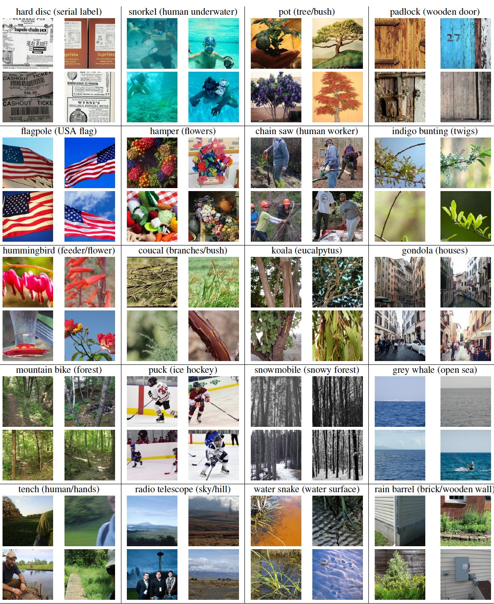

# Spurious Features Everywhere - Large-Scale Detection of Harmful Spurious Features in ImageNet

This repository will contain the code for our paper [Spurious Features Everywhere - Large-Scale Detection of Harmful Spurious Features in ImageNet] including the *Spurious ImageNet* dataset.

In this paper, we develop a framework that allows us to systematically identify spurious features in large datasets like ImageNet. It is based on our neural PCA components and their visualization.
By applying this framework (including minimal human supervision) to ImageNet, we identified 319 neural PCA components corresponding to spurious features of 230 ImageNet classes. For 40 of these features, we validated our results by 
collecting images from the OpenImages dataset which show the spurious feature and do not contain the actual class object but are still classified as this class. 

<p align="center">
  
</p>

## The *Spurious ImageNet* Dataset
We selected 40 of our spurious features and collected 75 images from the top-ranked images in OpenImages according to the value of $\alpha_l^(k)$, each containing only the spurious feature but not the class object.
This dataset can be used to measure the reliance of image classifiers on spurious features. It has the advantage that it consists of real images and thus provides a realistic impression of the performance of ImageNet classifiers in 
the wild. 

<p align="center">
  
</p>

### Setup
#### Download Images
Clone this repository and download the dataset:
```
git clone git@github.com:YanNeu/spurious_imagenet.git
cd spurious_imagenet/dataset/spurious_imagenet
wget https://www.dropbox.com/s/o7p5gq9i045921f/images.zip?dl=0
unzip images.zip
rm images.zip
```

#### Adjust `imagenet_path`
Open `utils/datasets/paths.pyÄ and adjust the `base_data_path` in line 6, the default value is `/scratch/datasets/`. Note that we assume that you have extracted ILSVRC2012 to `base_data_path/imagenet`. If this does not match your folder layout, you can also directly manipulate `get_imagenet_path` in line 64. For example if your dataset is located in `/home/user/datasets/ilsvrc2012/` you could change the function to:

```
def get_imagenet_path():  
    path = `/home/user/datasets/ilsvrc2012/` 
    return path
```

#### Robust ResNet50
Download the weights from [here](https://drive.google.com/file/d/169fhxn5X2_1-5vWTepkKJZRMdr8z4b9p/view?usp=sharing) into `utils` and unzip the model.

### Required Packages
Required packages are listed in `reqs.yml`. The `robustness` package needs to be installed from the corresponding github repo:
```
conda env create -f reqs.yml
conda activate spurious_imagenet
cd utils
wget https://github.com/MadryLab/robustness/archive/refs/heads/master.zip
unzip master.zip
rm master.zip
pip install -e robustness-master
```

### Compute Spurious mAUC
A classifier $f$ not relying on the spurious feature should predict a low probability for class $k$ for the Spurious ImageNet samples, especially compared to test set images of ImageNet for class $k$. Thus, for each class, we measure the AUC (area under the curve) for the separation of images with the spurious features but not showing class k versus test set images of class k according to the predicted probability for class k. A classifier not depending on the spurious feature should easily attain a perfect AUC of 1. We compute the mean AUC over all 40 classes.

Use `dataset/spurious_score.py` and replace `get_model` to evaluate your model. A table with results will be saved as `dataset/spurious_imagenet/evaluation/<*model name*>/spurious_score.txt`:

"""
\*#\* Model
model_name = "robust_resnet"
model, img_size = get_model(device, device_ids, model_name)
    
\*#\* Evaluation
eval_auc(model, model_name, img_size, device, bs)
"""


## Class-wise Neural PCA
The folder `neural_pca` contains all code to compute the class-wise neural PCA components of ImageNet classes and corresponding visualisations. The script `neural_pca/example.py` shows how to compute the $\alpha$ values and visualisations for the top 10 components for a given class.

