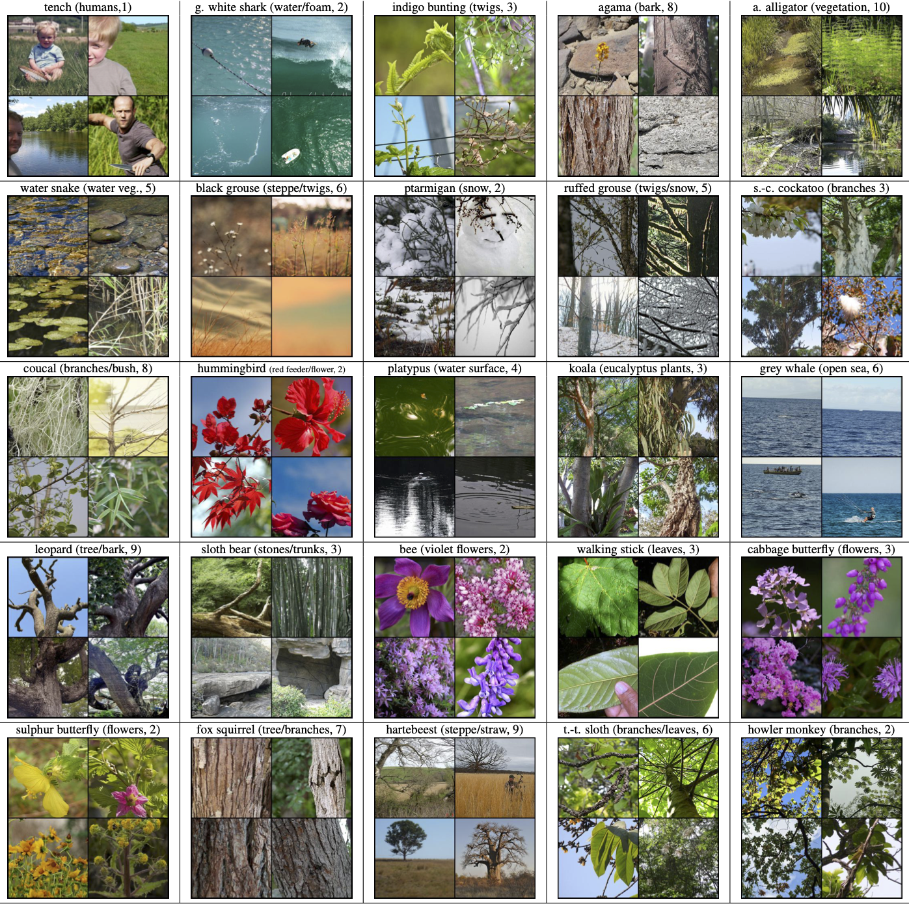

# Spurious Features Everywhere - Large-Scale Detection of Harmful Spurious Features in ImageNet
Yannic Neuhaus, Maximilian Augustin, Valentyn Boreiko, Matthias Hein\
*University of Tübingen*

Accepted to ICCV 2023

This repository contains the code for our paper [Spurious Features Everywhere - Large-Scale Detection of Harmful Spurious Features in ImageNet](https://arxiv.org/abs/2212.04871) including the *Spurious ImageNet* dataset.

In this paper, we develop a framework that allows us to systematically identify spurious features in large datasets like ImageNet. It is based on our neural PCA components and their visualization.
By applying this framework (including minimal human supervision) to ImageNet, we identified 322 neural PCA components corresponding to spurious features of 233 ImageNet classes. For 100 of these features, we validated our results by  collecting images from the OpenImages dataset which show the spurious feature and do not contain the actual class object but are still classified as this class. Moreover, we introduce SpuFix as a simple mitigation method to reduce the dependence of any ImageNet classifier on previously identified harmful spurious features without requiring additional labels or retraining of the model. 

<p align="center">
  
</p>

## Table of contents

1. [The *Spurious ImageNet* Dataset](#spurious-imagenet)
   1.  [Spurious Score](#spurious-score)
   2. [Benchmark](#benchmark)
   3. [Evaluate your model](#evaluate)
   4. [Example images](#example-images)
2. [SpuFix](#spufix)
   1. [Compute SpuFix wrapper for your model](#spufix-wrapper)
   2. [Evaluate your SpuFix model](#evaluate-spufix)
3. [Class-wise Neural PCA](#neural-pca)
4. [Setup](#setup)
   1. [Download data](#download-data)
   2. [Create conda env](#create-env)
   3. [Adjust `imagenet_path`](#path)
   4. [Download Robust ResNet50](#robust-resnet)
5. [Citation](#citation)


<a id="spurious-imagenet"></a>

## The *Spurious ImageNet* Dataset 

We selected 100 of our spurious features and collected 75 images from the top-ranked images in OpenImages according to the value of $\alpha_l^{(k)}$, each containing only the spurious feature but not the class object.
This dataset can be used to measure the reliance of image classifiers on spurious features. It has the advantage that it consists of real images and thus provides a realistic impression of the performance of ImageNet classifiers in 
the wild. 

<a id="spurious-score"></a>

### Spurious Score 

A classifier $f$ not relying on the spurious feature should predict a low probability for class $k$ for the Spurious ImageNet samples, especially compared to test set images of ImageNet for class $k$. Thus, for each class, we measure the AUC (area under the curve) for the separation of images with the spurious features but not showing class $k$ versus test set images of class $k$ according to the predicted probability for class $k$. A classifier not depending on the spurious feature should easily attain a perfect AUC of 1. We define our spurious score as the mean AUC over all 100 classes.

<a id="benchmark"></a>

### Benchmark 

#### Table: Spurious score and ImageNet validation accuracy for different model architectures and (pre-)training datasets (including results for SpuFix)

<p align="center">
  
</p>

#### Spurious score vs validation accuracy (arrows show the improvement using SpuFix)

<p align="center">
  
</p>

<a id="evaluate"></a>

### Evaluate your model 
Use `dataset/evaluate_model.py` and replace `get_model` to evaluate your model. For pre-trained models from the timm library you can just set `model_name` accordingly instead. A table with results will be saved as `dataset/spurious_imagenet/evaluation/<*model name*>/spurious_score.txt`:

```
    model_name = args.model
    model, img_size = get_model(device, device_ids, model_name)
    
    # load datasets
    spurious_loader, in_subset_loader = get_loaders(img_size, bs)

    eval_spurious_score(model, model_name, device, spurious_loader, in_subset_loader)

```

<a id="example-images"></a>

### Example images 
<p align="center">
  
</p>
<p align="center">
  
</p>
<p align="center">
  
</p>
<p align="center">
  
</p>


<a id="spufix"></a>

### SpuFix
SpuFix mitigates the reliance of any ImageNet classifier on the spurious features detected in this work without requiring additional labeling or re-training of the models. Follow the instructions below to compute the SpuFix wrapper for your ImageNet model and evaluate it on the *Spurious ImageNet* benchmark:


<a id="spufix-wrapper"></a>

#### Compute SpuFix wrapper for your model 
You will find the code to create the SpuFix wrapper for your own model in the file `spufix/spufix_wrapper.py`. For pre-trained models from the timm library it is sufficient to provide the `model_id`. For other models, just replace the functions `get_model` and `get_last_layer` with your model and its last (linear) layer (`img_size` should contain the input size of your model in the format `(3, <size>, <size>)`). 

```
    model, img_size = get_model(device, device_ids, model_id)
    
    multi_gpu  = not device_ids is None
    last_layer = get_last_layer(model_id, model, multi_gpu)

```

Running 
```
python spufix_wrapper.py --gpu 0 1 --bs 64 --model_id 'resnet101'
```
will pre-compute the wrapper for a pre-trained ResNet101 from timm. Afterwards, you can load it using the `load_spufix_model` function (see `spufix/spufix_wrapper.py` for details).


<a id="evaluate-spufix"></a>

#### Evaluate your SpuFix model
Evaluate your SpuFix model with the script `dataset/evaluate_spufix.py`. Just provide the model, its input size and its last layer analogously to `spufix/spufix_wrapper.py` (for pre-trained timm models it is sufficient to set `--model_id` accordingly). Call the script with the argument `--load_direction` if you already computed the SpuFix wrapper. Here is an example to evaluate the pre-trained ResNet101 from timm on two CUDA GPUs with batchsize 64:

```
python evaluate_spufix.py --gpu 0 1 --bs 64 --model_id 'resnet101' --load_direction
```

<a id="neural-pca"></a>

## Class-wise Neural PCA 
The folder `neural_pca` contains all code to compute the class-wise neural PCA components of ImageNet classes and corresponding visualisations. The script `neural_pca/example.py` shows how to compute the $\alpha$ values and visualizations for the top 10 components for a given class.

<a id="setup"></a>

### Setup 

First step is to clone this repository:
```
git clone git@github.com:YanNeu/spurious_imagenet.git
cd spurious_imagenet
```


<a id="download-data"></a>

#### Download data 
Run 
```
bash setup_download.sh
```
to download the images and precomputed alpha values (required for *SpuFix*).


<a id="create-env"></a>

#### Create conda environment 
Run
```
conda env create -f reqs.yml
conda activate spurious_imagenet
```
to install the conda environment `spurious_imagenet`. The robustness package has to be installed using:
```
cd utils
wget https://github.com/MadryLab/robustness/archive/refs/heads/master.zip
unzip master.zip
rm master.zip
pip install -e robustness-master
```


<a id="path"></a>

#### Adjust `imagenet_path` 
Open `utils/datasets/paths.py` and adjust the `base_data_path` in line 6, the default value is `/scratch/datasets/`. Note that we assume that you have extracted ILSVRC2012 to `base_data_path/imagenet`. If this does not match your folder layout, you can also directly manipulate `get_imagenet_path` in line 64. For example if your dataset is located in `/home/user/datasets/ilsvrc2012/` you could change the function to:

```
def get_imagenet_path():  
    path = `/home/user/datasets/ilsvrc2012/` 
    return path
```

<a id="robust-resnet"></a>

#### Download Robust ResNet50 
Download the weights from [here](https://drive.google.com/file/d/169fhxn5X2_1-5vWTepkKJZRMdr8z4b9p/view?usp=sharing) into `utils` and unzip the model.


<a id="citation"></a>

## Citation 

```bibtex
@article{neuhaus2022spurious,
  title={Spurious Features Everywhere--Large-Scale Detection of Harmful Spurious Features in ImageNet},
  author={Neuhaus, Yannic and Augustin, Maximilian and Boreiko, Valentyn and Hein, Matthias},
  booktitle={ICCV},
  year={2023}
}
```


